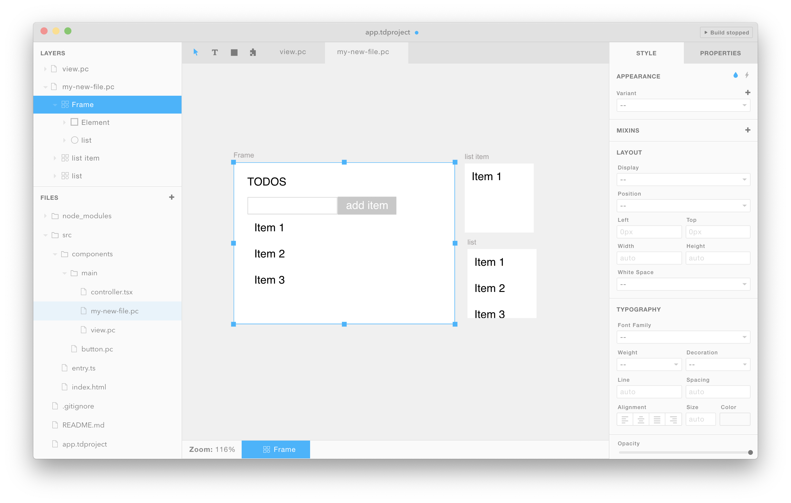

**Installation**: `npm install paperclip-react-compiler`

#### Importing Tandem UIs into React

This module compiles Tandem UIs into React components, and typed definition files for those components. For example, say you have a `components.pc` UI file that looks like this:



Assuming that you don't have any [controllers](#adding-controllers) associated with the components above, you can use them like so:

```javascript
import {Application, Button, ListItem} from './path/to/components.pc';

<Application />
<ListItem />
<Button />
```

> To import `*.pc` files like this, you'll need to use the [webpack loader](../paperclip-react-loader), or the [CLI tool](#cli-usage).

Notice that the components above are all exported using their labels converted to PascalCase: `list item` is imported as `ListItem`, `Button` is imported as `Button` (no change since already PascalCase), and `Application` is imported as `Application`.

#### Setting properties to nested nodes

An example is probably a better tool to illustrate how to set props. Looking at the layer names of our simple todo app:


If we want to define props for `new item input` & `add item button`, we can do that like so:

```javascript
<Application
  newItemInputProps={{ onChange: onNewItemInputChange }}
  addItemButtonProps={{ onClick: onAddItemButtonClick }}
/>
```

#### Adding controllers

#### Using slots

#### CLI Usage
